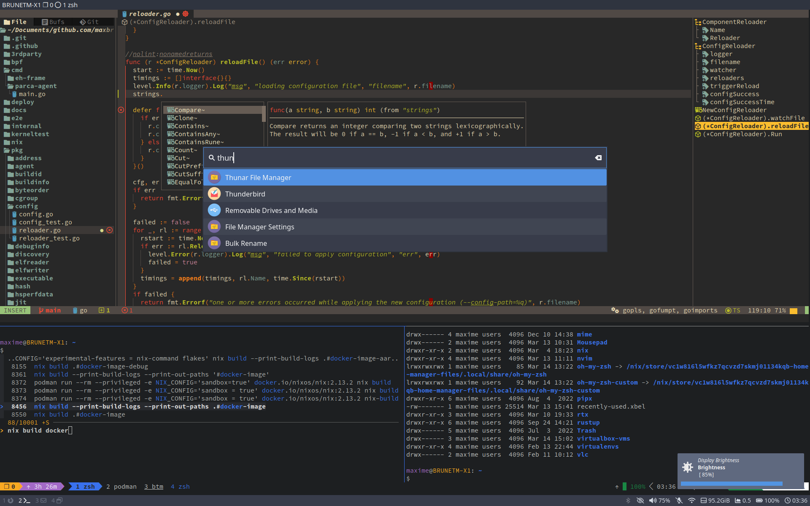

# My Awesome Dotfiles

My dotfiles collection for a flawless workflow. Starring `zsh`, `nvim`, `tmux`, and [NixOS](https://nixos.org).



## Bootstrapping NixOS

> [!WARNING]
>
> All data will be erased to install NixOS! These instructions are not indented for any users but myself (**@maxbrunet**), read scripts carefully!

1. Download and boot the [NixOS installer](https://nixos.org/download.html#nixos-iso)
2. If using WiFi, connect to it:

   ```shell
   wpa_passphrase <ESSID> | sudo tee /etc/wpa_supplicant.conf
   sudo wpa_supplicant -B -i wlp3s0 -c /etc/wpa_supplicant.conf
   ```

3. Run bootstrap script:

   ```shell
   sudo -i
   nix-env -iA nixos.git
   git clone https://github.com/emmanuelvargas/nixosdotfiles.git
   cd dotfiles
   ./scripts/bootstrap.sh <HOSTNAME>
   reboot
   ```

4. Generate SSH key:

   ```shell
   /etc/nixos/scripts/generate-ssh-key.sh
   ```

5. Install Rust toolchain:

   ```shell
   rustup toolchain install stable --component rust-analyzer
   ```

> [!NOTE]
>
> If running in VirtualBox, ensure:
>
> - EFI is enabled
> - 3D acceleration is enabled
> - Solid-state Drive is checked for the virtual disk

## Bootstrapping macOS

> At least it is not Windows.

1. Install [Nix](https://nixos.org/download.html#nix-install-macos)
2. Install the dotfiles:

   ```shell
   mkdir -p ~/.config
   git clone https://github.com/emmanuelvargas/nixosdotfiles.git ~/.config/darwin
   cd ~/.config/darwin
   git remote set-url origin git@github.com:emmanuelvargas/nixosdotfiles.git
   ```

3. Prepare system for `nix-darwin`:

   ```shell
   sudo mv /etc/bashrc /etc/bashrc.orig
   sudo mv /etc/shells /etc/shells.orig
   sudo mv /etc/zshrc /etc/zshrc.orig
   sudo mv /etc/nix/nix.conf /etc/nix/nix.conf.orig
   printf 'run\tprivate/var/run\n' | sudo tee -a /etc/synthetic.conf
   /System/Library/Filesystems/apfs.fs/Contents/Resources/apfs.util -t
   ```

4. Install [nix-darwin](https://daiderd.com/nix-darwin/):

   ```shell
   nix --extra-experimental-features 'flakes nix-command' build ".#darwinConfigurations.$(scutil --get LocalHostName).system"
   ./result/sw/bin/darwin-rebuild switch --flake .
   ```

5. Change login shell to Nix's Zsh:

   ```shell
   chsh -s /run/current-system/sw/bin/zsh maxime
   ```

6. Configure SSH client:

   ```shell
   ssh-keygen -t ed25519 -a 100
   cat >>~/.ssh/config <<EOF
   Host *
     SetEnv LC_ALL=C
     UseKeychain yes
   EOF
   ```

7. Set up Podman machine:

   ```shell
   sudo podman-mac-helper install
   podman machine init --cpus=4 --memory=4096 --now

   # https://github.com/k3d-io/k3d/issues/1082
   podman machine ssh bash -e <<EOF
   echo 'Delegate=cpuset' | sudo tee -a /etc/systemd/system/user@.service.d/delegate.conf
   sudo systemctl daemon-reload
   sudo systemctl restart user@\${UID}
   EOF

   cat >>~/.ssh/config <<EOF
   Host localhost
   	IdentityFile $(podman machine inspect --format='{{.SSHConfig.IdentityPath}}')
   EOF
   ```
